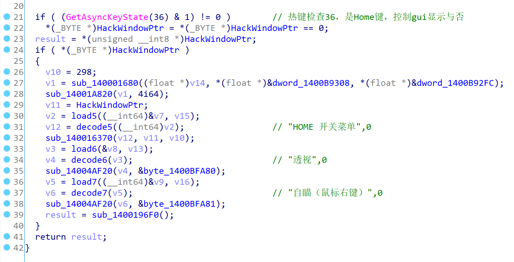
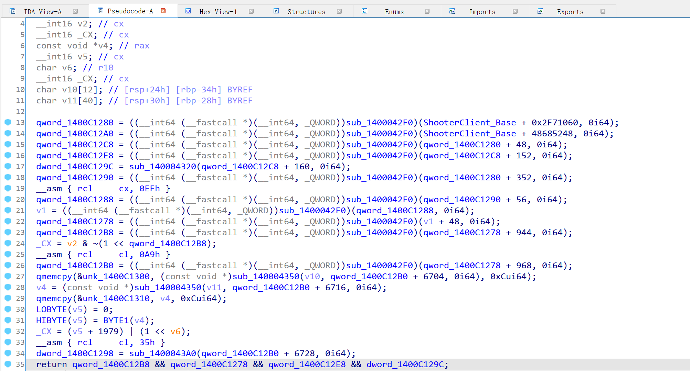

# 期末作业


[TOC]


*   我参考并学习的article链接

1.   [UE4逆向笔记之GWORLD GName GameInstance](http://www.pentester.top/index.php/archives/117/)
2.   [Quick look around VMP 3.x - Part 1 : Unpacking](https://whereisr0da.github.io/blog/posts/2021-01-05-vmp-1/)
3.   [Trouver l'OEP](https://baboonrce.github.io/category/unpacking.html)

*   作业环境

| OS                   | Arch    |
| -------------------- | ------- |
| Microsoft Windows 10 | Intel64 |

*   使用工具或插件

| Tools          | Version               |
| -------------- | --------------------- |
| Detect It Easy | v3.01                 |
| Cheat Engine   | v7.5                  |
| IDA Pro        | v7.5                  |
| x64dbg         | Jun 15 2022, 19:59:36 |
| Scylla x64     | v0.9.8                |
| ScyllaHide     | v1.4.750              |
| ApiBreak       | v0.5                  |


## 1. 游戏引擎框架初步分析

​	在分析外挂之前，先了解一下目标游戏的框架背景。


​	直接查看游戏属性，发现基于虚幻引擎Unreal Engine，版本是4.22，故后续分析游戏对象的类继承关系必须详细了解UE4版本的下的类继承关系结构和导图。


​	如上图，从**UWORLD**到**GameInstance**到**ULocalPlayer**到**LocalPlayer**到**PlayerController**乃至角色对象**AActor**，UE4中有着层次非常丰富的类继承关系，所以如果我们要找到游戏中指定的对象属性，需要找到一条很长的**实例对象指针链**才能访问该对象的属性。

​	同时ULevel下的**ActorCount**和**ActorArray**存放着所有角色对象，可以通过它们遍历游戏场景中的所有角色。


​	进入游戏，分析外挂，`HOME`键可以控制外挂菜单的开关，单击菜单可以控制外挂的开关。

1.   透视：相对位置在屏幕视野内的机器人目标是可以被标记出来的，格式为`机器人[%dm]`。
2.   自瞄：单击鼠标右键，准星会自动吸附距离最近的一个机器人的身体。

## 2. 外挂程序初步分析

### 2.1 hack.exe反反调试与内存dump

​	查看hack.exe程序的情况，似乎没有扫出保护层。


​	用x64dbg打开，直接F9往后调试，当看到`EntryPoint`时就已经觉得不对劲了，因为是熟悉的“push imm, call”结构，说明存在保护壳。继续向下调试，hack.exe停止工作，说明还存在反调试，所以先破一下反调试。	


​	hack.exe的入口点如下图，这是VMProtect虚拟化保护的常见特征，下面先绕过反调试，再通过进入程序内部后查看函数调用栈回溯来判断OEP。


​	使用ScyllaHide绕过vmp的反调试。（有工具干嘛自己动手~


​	进入EntryPoint后连续按3次F9被nop断下后，即可绕过反调试。


​	在之后单步运行，其实这里有两种方法，一种是下图我在程序读入窗口的交互信息时断下，可以看到明显的PeekMessageA、TranslateMessage、DispatchMessageA等窗口交互库的调用，我在这里的栈中检查函数调用链，在倒数第二个call调用中找到了疑似main函数的调用。


​	调用链为`call [0x1400525A4]`->`call [0x14003480]`->`call [0x14004CD10]`


​	逐个查看调用链，可以发现`call hack.140003480`前有3个参数，分别是ecx = 1、rdx = "\...\\\hack.exe"，r8 = "...\\\\ProgramData"，调用ret后也有返回值eax。

​	这是很明显的`int main(int argc, const char* argv[], const char* envp[])`型调用，其中ecx表示命令行中只有一个字符串，rdx表示那一个字符串是hack.exe的路径，r8表示环境信息。


​	上述特征在其它call调用前是没有的，所以猜测hack.140003480在start层，那么向前回溯可以找到`public start` OEP：`0x14005200C`


​	另一种寻找OEP的方法是通过插件`Api Break`对指定内核系统调用下断点，这样就能进入程序分析调用栈，回溯拿到OEP，如`CreateToolhelp32Snapshot`、`GetModuleHandleA`、`OpenProcess`等注入程序常用的内核调用API，具体流程这里不赘述。


​	拿到OEP后使用插件`Scylla x64`进行内存dump，再用Fix Dump将引用表导入修复文件，得到脱壳版hack.exe即hack_dump_FIX.exe（插件默认起名为SCY，我改为FIX）。                                                 


### 2.2 hack_dump_FIX.exe逆向分析

​	用IDA Pro直接打开hack_dump_FIX.exe，直接分析`F5`反汇编后的main函数。（下图是经过我逆向分析后的效果）


​	可以看到外挂读写游戏内存主要通过`GetPIDByName`、`FindWindowA`、`GetClientRect`、`GetBaseByName`等函数得到游戏进程ID、窗口句柄和进程基址等。	

​	如图，程序中的所有字符串都被加密，所以必须通过`loadx();decodex();`两个函数解码才能得到字符串信息，但是我们可以直接**通过动态调试得到明文**，所以得到这些字符串明文不成问题（如下图所示）


​	下图是解密逻辑，其实挺简单的，如果没有动态调试也能直接破解：


​	知道字符串变量的明文后，看这些伪代码就和看源码差不多了。

​	首先是` th32ProcessID = GetPIDByName(v4);`，进入函数`GetPIDByName(v4)`可以发现两个熟悉的内核调用，他们表示在进程快照中迭代遍历模块表，从而找到指定的模块基址。


​	其次是`ShooterClient_Base = (__int64)GetBaseByName(v9)`找到了`ShooterClient.exe`模块的基址，这在后续访问UWorld下的子类起重要作用。（**内部函数的逻辑和上图完全一致，这里就不列出图片了。**）

​	最后是一个类似malloc的函数分配了一块内存，同时设定了窗口的长、宽和字体类型simhei.ttf，可以推断这段代码最后的函数**CreateHackWindow()**维护了一个外挂的菜单窗口HackWindow。传入的**3个参数**分别是内存指针**HackWindowPtr**，**格式结构体v25**和一个函数指针**Hacking**。


​	进入**CreateHackWindow**函数，发现只是普通的窗口更新函数，并没有明显的与作弊相关的代码，但其中有一处使用了传入的**Hacking**指针。它影响了每次窗口的更新，故CreateHackWindow中传入的函数指针Hacking应该会是外挂实现的主要逻辑。


​	进入Hacking函数，里面有两个函数，我在后期CE调试ShooterGame后推断出了它们的具体作用，但当前只能初步分析。


​	进入第一个函数，`GetAsyncKeyState`是一个热键检查调用，网上查了数值`36`对应了键盘上的`Home`键，整个外挂程序只有一个地方使用的`Home`键，就是进入外挂后的那个窗口菜单，故显然这里是一个初始化`HackMenu`外挂菜单的逻辑。



​	进入第二个函数的其中一个子函数，可以看到从**ShooterClient_Base**开始往下都是对某一个**基地址+偏移**再传入一个函数，而函数中都有**内存读取和内存复制**的函数调用，故可知这些都是对游戏引擎中一些重要类对象的读取。	

​	看到这里，就必须要知道这些偏移地址究竟代表着哪些类，故下面开始分析ShooterGame。

## 3. 游戏内存初步分析

### 2.1 用CE进行游戏内容的简单分析

​	用**CheatEngine**挂载ShooterGame进程，尝试按照TLearning视频课中的方式，找到一些与游戏数据相关的内存。


​	进入游戏，可以看到手上的枪械有50发子弹，故先在CE中筛选值为`50`的内存。


​	开枪，子弹还剩39发，使用`Next Scan`筛选出值为`39`的内存地址。


​	如上图，只剩一块内存，说明`[0x2DC8723D284]`存放了子弹数量这个游戏关键信息。


​	通过类似的方法（就是反复的Scan`changed value`和`unchanged value`）我们也能在上图中确定角色坐标的存放地址（这里的坐标是用**浮点数**存储的，所以不能直观看出结果）。

​	但是可以发现每次重开游戏或者角色重生后，这个地址就和子弹数量没有关系了，这说明了游戏中角色对象的内存分配不会是静态的，而是动态的，故如果想要永久地访问关键内存，必须要获取到调用这个信息的指针链，下面开始分析指针链。

### 2.2	UE4.22游戏指针链分析

​	首先可以通过调试器来找到子弹所处的类地址。


​	以我分析出来的其中一个地址`bullet = [0x20538AFA5E4]`为例，用`F5`调试器找到访问这个地址的汇编代码。


​	通过`[rdi+0x584]`可以推断该对象的首地址为`0x20538AFA5E4 - 0x584 = 0x20538AFA060 `，这个地址就很可能是`AActor`角色对象的地址。但是像这样一层一层找是不现实的，故我们使用`Pointer Scan`功能进行指针链查找。


​	之前在IDA Pro中的逆向分析给了我参考，因为13和14行我已经确定了`ShooterClient_Base`基地址，而且也确定外挂所需要的两个偏移为`0x2F71060`和`0x2E6E0C0`故可以直接在**bullet.PTR**中进行筛选。


​	但可以看到过滤后的结果仍然非常多，所以需要得到一条确定的指针链。故通过网上学习相关UE4逆向笔记+IDA Pro对外挂汇编代码的分析，我们可以确定UWorld的子类中有一条**ULocalPlayer** -> **LocalPlayer** -> **PlayerController**的指针链，其中偏移为`+0x38`->`+0x0`->`+0x30`。（如下图所示）


​	通过这条指针链我们也能逆向到前面的变量，即通过`ULocalPlayer = [GameInstance + 0x38]`确认了**GameInstance**变量。

再根据IDA中的逆向信息筛选指针链：

```cpp
Object1 = [Base + 0x2F71060]
GameInstance = [Object1 + 0x160]
ULocalPlayer = [GameInstance + 0x38]
LocalPlayer = [UlocalPlayer + 0]
PlayerController = [LocalPlayer + 0x30]
Object2 = [PlayerController + 0x3B0]
Object3 = [PlayerController + 0x3CB]
```


​	上图是筛选出来的指针链，可以猜测指针链中的第一个对象其实是一个**UWorld**对象，而倒数两个未知的对象可能是**AActor**数组中的**角色基址**（**ActorArray[0]**）或者主玩家的角色地址。

​	下图显示IDA中剩下的两处未知指针链，由于已知`Uworld` -> `ULevel ` -> `ActorArray/ActorCount`链，所以也能分析出未知对象名（图中的偏移与实际稍有不同，这可能是因为这张图是UE4.23版本，但影响不大）


​	还有一个未知对象是`[base + 0x2E6E0C0]`，其实这个对象在后文中也较少使用。不过在后面对遍历ActorArray时解码机器人名字的函数`sub_1400020B0`中找到了**GName**的身影。调用链为`sub_1400020B0` -> `sub_140001E50` -> `ReadQwordMem(8*(a2 / 0x4000) + GName)`。


​	因为游戏中的**字符串名称**是单独存放的，在其他对象中的玩家、角色对象都是用**ID号**指代，当我们需要获取角色的字符串名称时，就必须要访问一个全局类对象`GName`，故这里的最后一个位置对象应该是GName。


​	至此我们已经得到了分析外挂逻辑所需要的重要信息——存放游戏中重要对象内存地址的变量，最后对传入`CreateHackWindow()`函数的`Hacking()`函数进行总结性分析。

​		

## 4. 外挂逻辑分析

​	显示外挂菜单gui的函数`ShowMenu()`我在前面已经分析完毕，因此本节主要分析作弊函数`Cheating()`


​		`Cheating`中第一、三个函数中并没有对游戏内存对象的调用，又由于传入了窗口指针`HackWindowPtr`，所以合理推断只是对窗口信息的更新而已。主要逻辑在第二个函数`CheatingMain()`中


​	`CheatingMain()`函数的第一部分主要内容就是遍历ActorArray()数组，从中筛选出所有Ai自动控制的Bot，同时保留他们的名称字符串。


​		`CheatMain()`的第二部分主要处理aibot位置坐标和玩家视角坐标。首先读取player坐标和bot坐标，计算距离并单位换算，然后在使用`HackWindowPtr`显示框框之前，先做了一次`CheckVision()`的检查，确定可以在**可视范围**内显示后才进行显示。最后也计算了屏幕中心到bot的距离，这是为后面自瞄程序做准备的。


​	下图是`CheckVision()`函数的返回值，有对`HackWindowPtr+0x10`和`HackWindowPtr+0x14`的调用。这明显是比较目标坐标是否超出了窗口的范围，如果超出范围透视的框框自然也无法在游戏中显示。


​	`CheatMain()`最后一个部分是有关自瞄的外挂逻辑，在计算了视角中心到目标bot的距离后，每次都会进行一次比较，维护`min_target`和`min_bot`变量，在外挂逻辑中，`min_bot`被作为`targetBot`与屏幕中心计算偏移距离，调用的是函数`Calcu_centroid_offset`，最后向`PlayerController+920`内存写入准心偏移，完成自瞄修改。


​	下面是写入准心偏移的主要依赖调用，其实就是利用`WriteProcessMemory`向进程句柄直接写入内存


## 5. 总结

​	综上，我先使用x64dbg和IDA Pro，通过反调试、解混淆、Dump内存找到外挂程序的关键代码，通过初步分析，我了解了外挂读写进程内存的方式和**修改进程内存**、**附加窗口信息**的方式。我确定了需要明确的游戏**关键逻辑**和**指针链**。

​	进而我用Cheat Engine分析游戏内存，通过附加调试器、查找指针链确定了游戏关键逻辑类对象的相对关系。

​	最后我回到IDA中逆向外挂程序，通过分析作弊主要函数逆向出了透视、自瞄外挂的主要实现原理，该程序读取非玩家机器人信息，并计算其与玩家相对位置，再分别将透视字符串通过进程窗口句柄写入窗口、通过`GameInstance`对象将自瞄准心偏移写入游戏内存。


